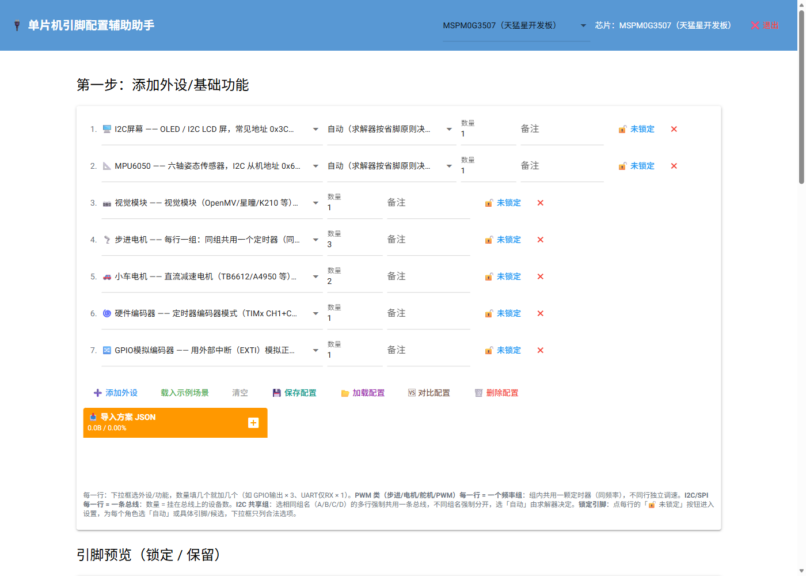
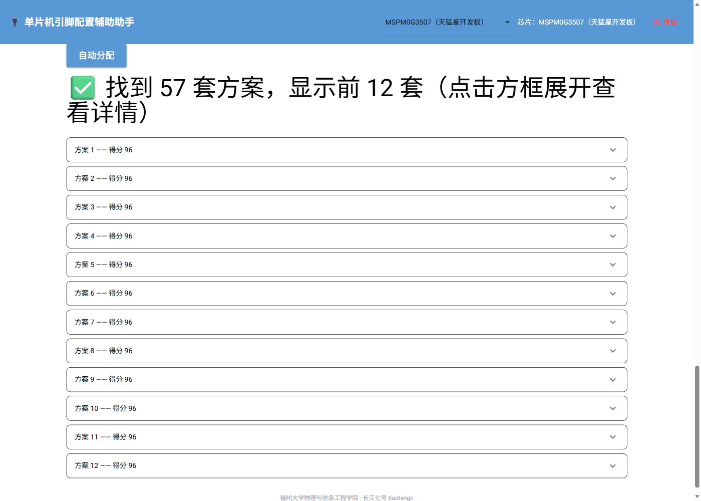
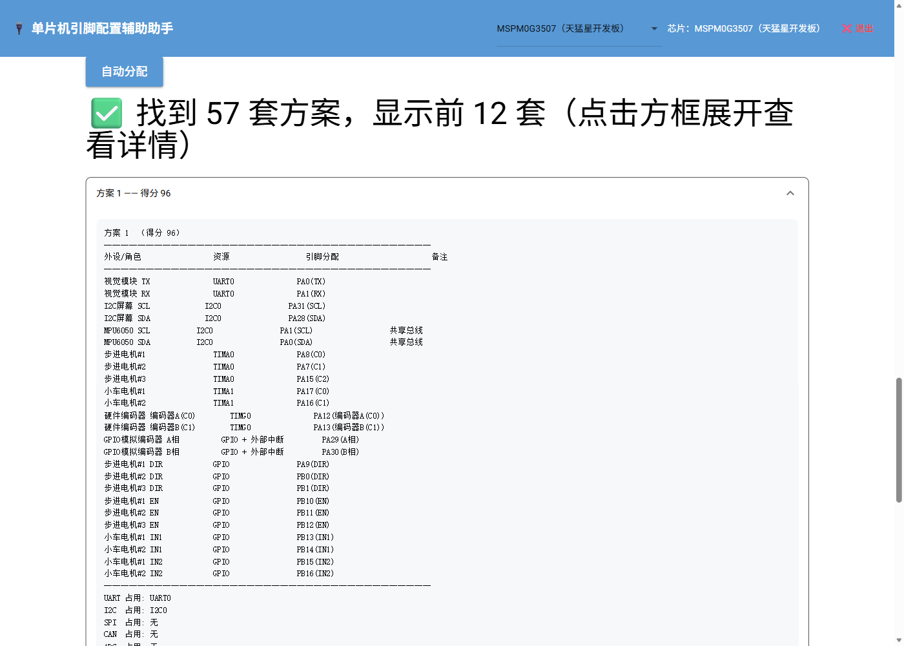
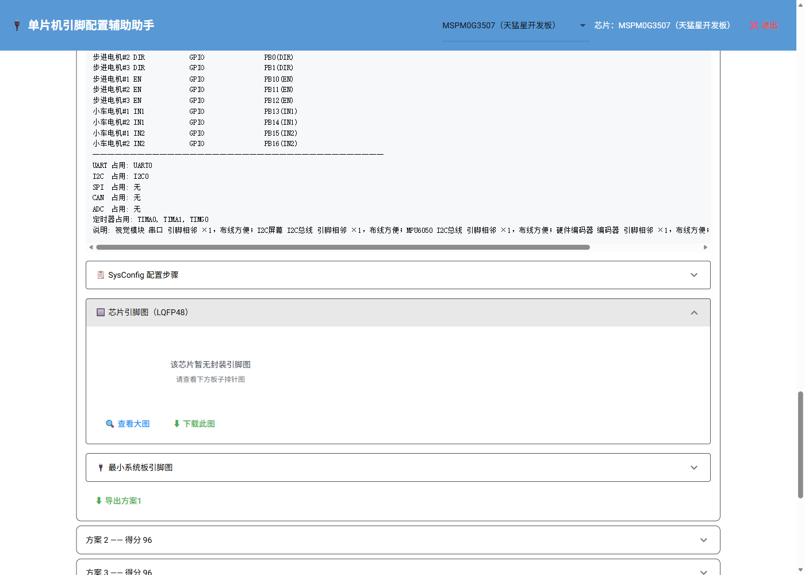

# 单片机引脚配置辅助助手

电赛电控专用：告诉它你用哪些外设，它自动给出 **STM32F103C8T6 / MSPM0G3507** 的最佳引脚分配方案，还能生成 CubeMX / SysConfig 配置步骤、导出引脚表、可视化引脚图。

> GitHub 仓库：https://github.com/tiantangc/pin_configuration_assistant
> 作者：福州大学物理与信息工程学院 · 长江七号 tiantangc

---

## 目录

- [这是什么](#这是什么)
- [怎么运行](#怎么运行)
- [快速上手（3 步）](#快速上手3-步)
- [功能详解](#功能详解)
- [常见问题 FAQ](#常见问题-faq)
- [已知说明](#已知说明)

---

## 这是什么

做电赛/单片机项目时，最头疼的就是**引脚分配**：哪些外设用哪些引脚、会不会和调试口/晶振/板载特殊脚冲突、定时器通道够不够……

这个工具把这件事自动化了：

1. 你在网页里勾选要用的外设（I2C 屏、MPU6050、步进电机、编码器……）；
2. 点一下「自动分配」；
3. 它算出一堆可行方案（按得分排序），并给出每个引脚的用途、CubeMX / SysConfig 配置步骤、引脚图。

**不用装 Python，双击 exe 就能用。**

---

## 怎么运行

### 方式一：零安装版（推荐，普通用户）

1. 打开 [GitHub Releases](https://github.com/tiantangc/pin_configuration_assistant/releases) 页面；
2. 下载最新版的 `PinConfigAssistant.exe`；
3. 双击运行，会自动打开浏览器（http://127.0.0.1:8080）。

> **提示**
> - 用完点右上角「❌ 退出」关闭程序；
> - 浏览器误关了但程序还在跑，再双击 exe 会自动弹出已有网页；
> - 部分杀毒软件可能对 PyInstaller 打包的单文件 exe 误报，点「仍要运行 / 添加信任」即可。

### 方式二：源码运行（开发者）

需要 Python 3.8+。

```bat
cd /d F:\pin_configuration_assistant
pip install nicegui
python app.py
```

浏览器打开 http://127.0.0.1:8080 即可。

---

## 快速上手（3 步）

**第 1 步：选芯片**

右上角下拉框选择你的主控：STM32F103C8T6（C8T6 最小系统板）或 MSPM0G3507（天猛星开发板）。

**第 2 步：添加外设**

点「➕ 添加外设」，每一行选一个外设类型，填数量。也可以直接点「载入示例场景」体验。

**第 3 步：自动分配**

点底部蓝色「自动分配」按钮，等一两秒，下方就出现按得分排序的方案列表。



---

## 功能详解

### 1. 添加外设 / 基础功能

每个外设是一行，包含：

- **外设下拉框**：21 个模板，涵盖 I2C 屏、MPU6050、视觉模块、步进电机、小车电机、编码器、DBUS 遥控、舵机、SPI 屏，以及 GPIO / UART / I2C / SPI / CAN / ADC / EXTI 等基础功能；
- **数量**：填几个就分配几路（如「GPIO 输出 × 3」）；
- **备注**：给这行起个名字（如「底盘左电机」），会显示在结果和引脚图标注里；
- **🔓 未锁定**：点它可为每个角色指定固定引脚，或从合法候选里选；
- **✖**：删除这一行。

几个关键规则：

- **PWM 类（步进/电机/舵机/PWM）每一行 = 一个频率组**：组内共用一个定时器（同频），不同行独立调速；
- **I2C / SPI 每一行 = 一条总线**：数量 = 挂在总线上的设备数；
- **I2C 共享组（A/B/C/D）**：相同组名的多行强制共用一条总线，不同组名强制分开，选「自动」由求解器决定。

### 2. 智能求解

点「自动分配」后，求解器会：

- 检查硬约束：引脚冲突、定时器通道冲突、定时器 remap 冲突、UART/SPI/CAN/I2C 实例冲突、EXTI 线互斥、ADC 通道冲突；
- 优先避开板载特殊脚（LED、USB、JTAG、32.768k 晶振等）；
- 给「成对/成组」的外设（UART TX/RX、I2C SCL/SDA、SPI 三线等）物理靠近加分；
- 按得分从高到低排序，显示前 12 套方案。



如果**没有可行方案**，它会告诉你具体是哪种资源不足（定时器/UART/I2C/SPI/CAN/ADC/EXTI/GPIO），并给出软件模拟建议（软件 I2C、软件 PWM、GPIO 模拟编码器等）。

### 3. 查看方案详情

点开任意方案卡片，能看到：

- **引脚分配表**：每个外设角色对应哪个引脚（含备注、是否锁定）；
- **配置步骤**：STM32 给「📋 CubeMX 配置步骤」，MSPM0 给「📋 SysConfig 配置步骤」，照着点就行；
- **芯片引脚图 / 最小系统板引脚图**：按外设着色、工程图式引线标注每个引脚用途。





### 4. 引脚图可视化

两处都有引脚图：

- **引脚预览**（设置区）：锁定=橙色、保留=红色、空闲=浅灰，悬停看详情；
- **方案里的引脚图**：芯片图（LQFP48）+ 最小系统板排针图（F103 两排 / MSPM0 四排），支持「🔍 查看大图」和「⬇ 下载此图」（SVG / PNG / JPG）。

### 5. 导出方案

每套方案卡片底部有「⬇ 导出方案」，支持三种格式：

- **JSON**：可再次导入（导入后所有引脚自动锁定，可继续加外设增量分配）；
- **Markdown**：给人看，含完整引脚表和配置步骤；
- **CSV**：Excel / WPS 直接打开。

### 6. 方案保存 / 加载 / 对比 / 删除

设置区按钮：

- **💾 保存配置**：把当前外设 + 保留引脚 + 锁定存成一个命名方案；
- **📂 加载配置**：恢复已保存的方案；
- **🆚 对比配置**：对比两个方案的外设差异、保留引脚差异；
- **🗑️ 删除配置**：删掉不再需要的方案；
- **📥 导入方案 JSON**：导入之前导出的 JSON。

### 7. 设置保留引脚

第二步里可以手动添加「绝不使用」的引脚（比如你想留给别的用途的脚）。默认已保留 SWD 调试口、BOOT1、晶振脚，可按需删除。

---

## 常见问题 FAQ

**Q：双击 exe 后浏览器没自动打开？**
手动打开浏览器访问 http://127.0.0.1:8080 即可。

**Q：怎么关闭程序？**
点网页右上角「❌ 退出」，程序就关了。

**Q：浏览器关了程序还在跑，再双击打不开网页？**
双击 exe 会自动弹出已有网页（不会重复启动）。

**Q：为什么没有可行方案？**
减少外设数量、合并共享总线/定时器，或参考提示改用软件模拟（软件 I2C / 软件 PWM / GPIO 模拟编码器）。

**Q：杀毒软件报毒？**
PyInstaller 打包的单文件 exe 偶发误报，添加信任即可；介意的话用源码方式运行。

---

## 已知说明

- MSPM0G3507 天猛星板为**第一版**，欢迎测试反馈；
- F103C8T6 引脚数据为手工录入，正式使用前建议对照 CubeMX 或数据手册抽查；
- 定时器建模：同一 TIM 的 remap 全局唯一，`timer_pwm_exclusive` 独占整颗定时器。

---

## 命令行版（进阶）

```bat
cd /d F:\pin_configuration_assistant
python cli.py                        # 内置示例场景
python cli.py --list                 # 查看支持的芯片和外设
python cli.py --scenario "visual:1,stepper_motor:3" --top 5
```

---

## 项目结构

```
pin_configuration_assistant/
├── chips/               # 芯片引脚/复用数据库（JSON）
├── peripherals/         # 21 个外设模板（JSON）
├── solver.py            # 求解引擎（约束/评分/诊断）
├── cli.py               # 命令行入口
├── app.py               # 网页版入口（NiceGUI）
├── docs/images/         # 帮助文档截图
├── README.md            # 本文件
└── CHANGELOG.md         # 更新日志
```
